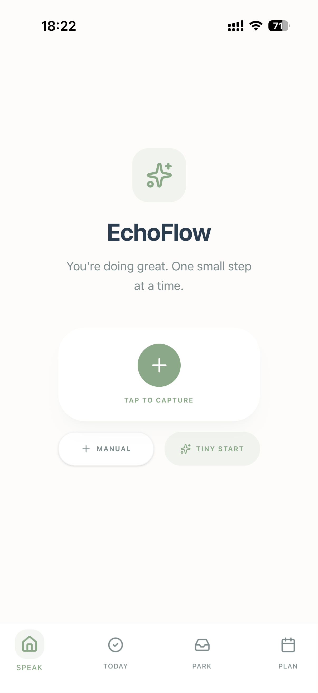
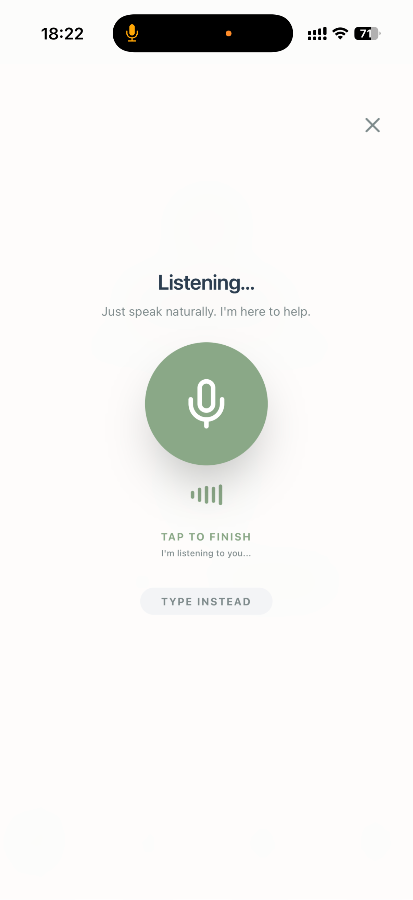
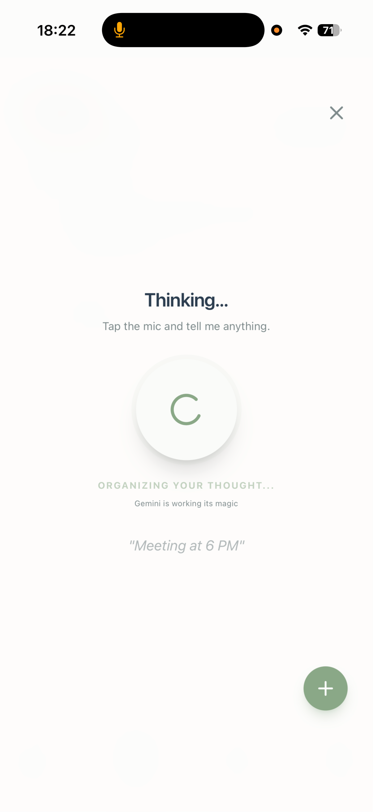
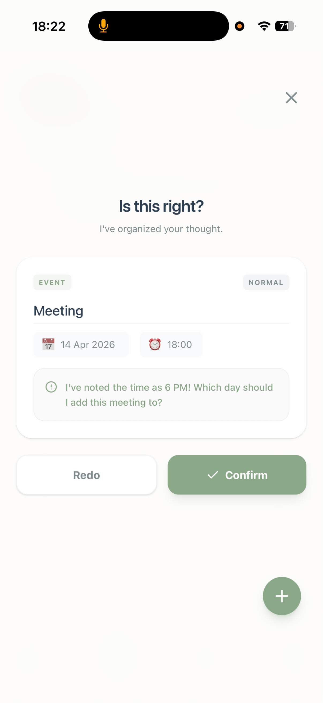
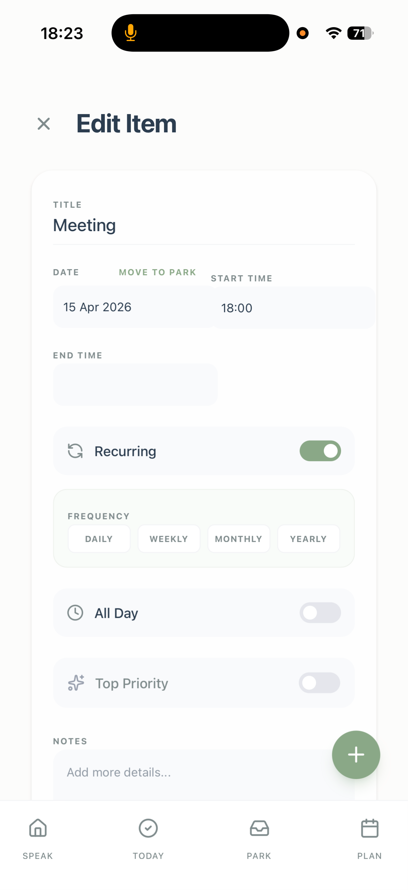
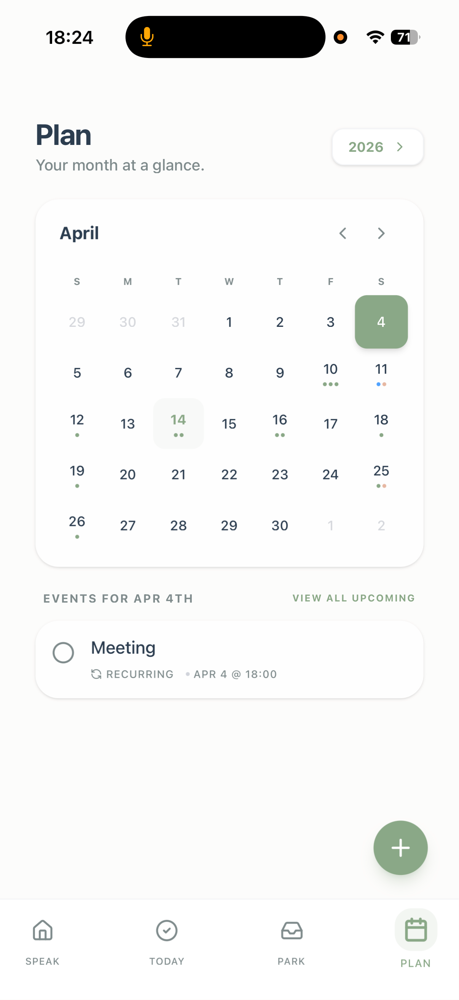
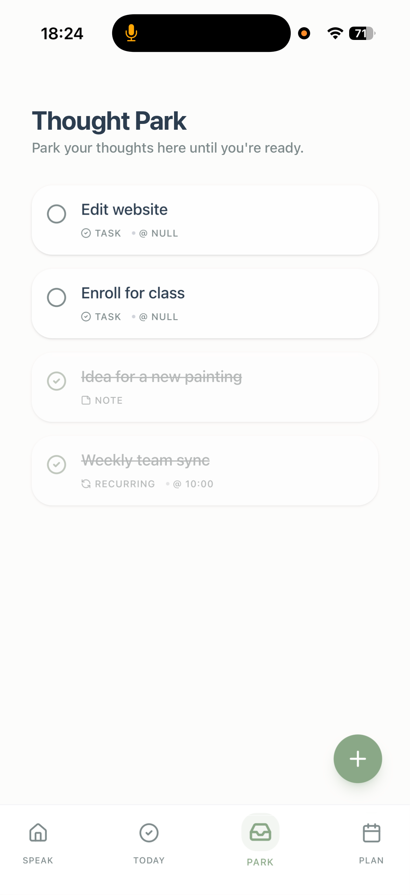
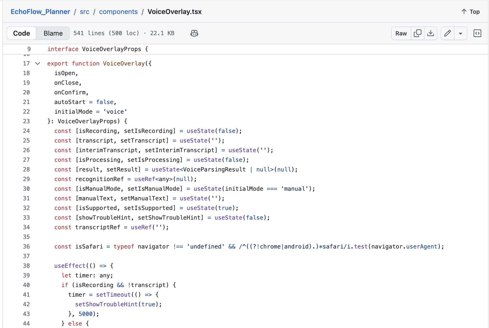

# EchoFlow – AI Voice Planner for ADHD-Friendly Productivity

EchoFlow is an AI-powered voice-first planner designed to reduce the friction of capturing thoughts, tasks, and events.

The product was designed with an ADHD-friendly workflow in mind: helping users move from **thought → structure → action** in the fewest steps possible.

---

## Why I Built This
I built EchoFlow to solve a very real problem: the gap between having a thought and actually turning it into action.

Traditional productivity tools often assume users can pause, organise their thoughts, and manually plan the next step. For many people, especially those who experience overwhelm, distractibility, or task initiation challenges, that friction can be enough for the thought to disappear entirely.

EchoFlow was designed to reduce that gap by making capture instant, organisation effortless, and action feel lighter.

---

## Problem
Traditional planner apps assume users can pause, organise, and manually structure their thoughts.

For users with ADHD, this creates friction:
- ideas are lost quickly
- task initiation feels overwhelming
- too many steps reduce follow-through

EchoFlow was designed to solve this through **voice-first capture and AI-assisted organisation**.

---

## Core Product Flow
1. **Capture instantly**
   - voice-first
   - tap to speak
   - manual fallback

2. **AI organises the thought**
   - task
   - event
   - note
   - recurring reminder

3. **User confirms**
   - edit date
   - add recurrence
   - prioritise
   - park for later

4. **Action surfaces naturally**
   - Today view
   - Plan calendar
   - Thought Park
   - Tiny Start prompts

---

## Key Features
- Voice-first task capture
- AI-powered event parsing
- Recurring reminders
- Thought Park (mental inbox)
- Tiny Start mode for overwhelm reduction
- Calendar / monthly planning
- ADHD-friendly UX patterns
- Local-first data storage design

---

## Product Screens

### Home + Voice Capture

  
  

### AI Processing + Confirmation + Editing

  
  
  

### Planning + Thought Park

  
  

---

## Technical Highlight
The screenshot below shows part of the `VoiceOverlay.tsx` component responsible for:
- recording state
- transcript state
- processing flow
- browser compatibility
- manual fallback
- UX recovery hints

  

---

## Tech Stack
- React
- TypeScript
- Voice input / browser speech APIs
- AI-assisted parsing workflow
- local-first storage architecture

---

## Product Design Focus
This project emphasises:

- reducing task initiation friction
- voice-first interaction design
- graceful fallback flows
- cognitive load reduction
- supportive, non-overwhelming UX

---

## Note
This repository is a **showcase version** of EchoFlow.

Selected implementation screenshots and product flows are shared for portfolio purposes while core production logic and service integrations remain private.
